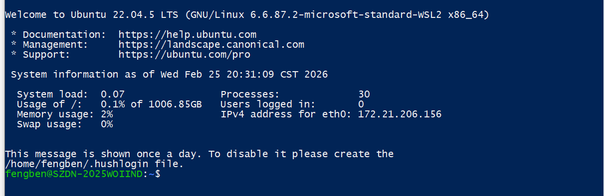
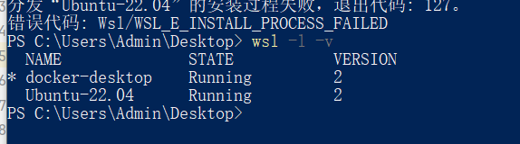
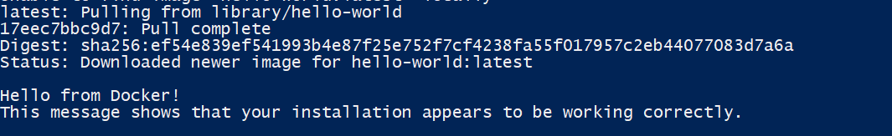

## 1. 环境安装，以及验证
### 1.1 安装 Ubuntu 22.04
 *  wsl --install -d Ubuntu-22.04

 *  查看已安装发行版及版本
 *  wsl -l -v

 *  设置Ubuntu-22.04 为默认 wsl 
 * wsl --set-default Ubuntu-22.04
 * 配置好以上以后， 输入wsl 即可进入终端， exit 即可退出终端

### 1.2 docker desktop 配置
* 配置 WSL2 集成

1. 启动 Docker Desktop（首次启动需几分钟初始化）
2. 右键任务栏 Docker 图标 → "Settings"
3. 按以下顺序配置：

步骤 1：启用 WSL2 引擎
• 进入 General 页面

• 确保勾选：✅ Use the WSL 2 based engine

步骤 2：配置 WSL 集成
• 进入 Resources → WSL Integration

• 勾选你的 WSL2 发行版（如 Ubuntu-22.04）

• 点击 Apply & Restart
在 WSL2 终端中执行：
* 检查 Docker 版本
* docker --version
* 检查 Docker 服务状态
* docker info

 步骤 3： 拉起 docker 跑 hello-world
* docker run hello-world
* 

## 问题回答
1. 为什么不用多 VM
* 聚焦精力，测试高并发，熟悉高并发 当前部署多VM 只会收获运维经验和熟练度，无法聚焦核心知识点学习
* 时机不成熟，当前状况下是快速跑通、验证。 不是为了从无到有搞多中间件那一套

2. 为什么选 Docker + WSL2
* 首先取决于我已有的资源本身就有一台windows系统的电脑，这个时候想要得到原生的支持只能装虚拟机或wsl2, 而虚拟机存在较大资源浪费
* 用docker 是可以快速移植，且后面的k8s，灰度发布等云原生都依赖于docker

3. 资源如何分配
* CPU：8–12 核  这是为了测试多线程，需要多核，后续也可根据核心设置不同的线程数来测试
* Memory：32 GB  容器内存空间，有两个目的，首先需要部署多个应用或中间件需要内存 其次不需要太大，好观测高并发测试下内存溢出问题
* Swap：8 GB 这个值是指容器内存超过限制时，可使用硬盘空间当作内存使用，不过速度会慢很多

4. 后续如何演进到 VM / 集群
* 后续可用 VMware、VirtualBox等工具创建虚拟机，主要为了测试网络抖动，跨区通信等问题